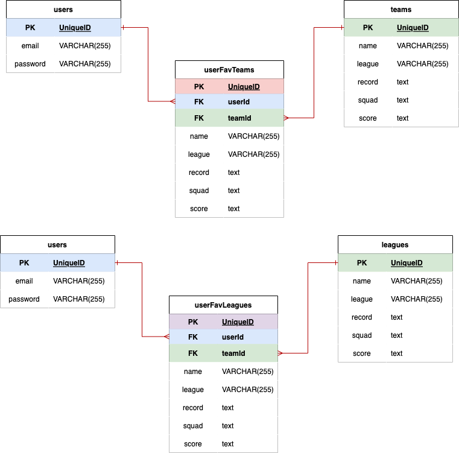

# FANDB

---
## Overview
- A multi-user application for soccer fans to save and track their favorite teams and leagues

---
## User Stories
- As a user, I want sign up for a fandb account with my email and password 
- As a user, I want to query by soccer team or league
- As a user, I want to click into a team or league and see additional information
- As a user, I want to save & delete my favorite teams and leagues to my profile for viewing
- As a user, I want be able to log out and back in to the fandb

---
## Wireframes

---
## RESTful Routes

| Verb: | Url Pattern: | Action(CRUD): | Description |
| ----- | ------------ | ------------- | -------------------------------------  |
| GET   |   /teams     |  Show/read    | List query results from team search form | 
| GET   |   /teams/:id |  Show/read    | Reveal team record, squad, etc. |
| PUT   |   /teams/:id |  Update       | Save team to profile, replace save button with delete|
| GET   |   /leagues     |  Show/read    | List query results from league search form | 
| GET   |   /leagues/:id |  Show/read    | Reveal league standings |
| PUT   |   /leagues/:id |  Update       | Save league to profile, replace save button with delete|
| GET   |   /profile   |  Show/read    | Show user favorite teams & leagues |
| DELETE|   /profile   |  Destroy      | Delete a user favorite |
| PUT   |   /profile   |  Update       | Add a team/league to user favorites list (from /x/:id) |

---
## API

[API-Football](https://www.api-football.com/documentation-beta)
- generated api key, fetched league data with axios

---
## Models
- Users
- Teams
- Leagues
- UserFavTeams
- UserFavLeagues 

---

## MVP
- User login/logout
- Home button
- Profile Button
- /profile displays user favorite teams and leagues
- Home displays search forms for leagues and teams
- Results displays list of teams or leagues user can click into for details 
- User can add/delete teams/leagues to profile favorites
---
## Stretch Goals
- Styling

---
## References

