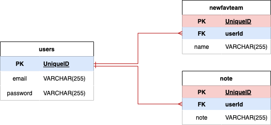

# FANDB

---
## Overview
- A multi-user application for soccer fans to save and track their favorite clubs

---
## Deployment Link

---
## Installation Instructions
- fork and clone this repo
- run npm i in console to install all dependencies
- run nodemon and view application at localhost:8000
- api key required to fetch results, register here: [API-Football](https://www.api-football.com/) and input your api key in index.js to replace ${process.env.FOOTBALL_API_KEY2}

---
## User Stories
- As a user, I want to sign up for a fandb account with my email and password 
- As a user, I want be able to log out and back in to the fandb
- As a user, I want to query by soccer team
- As a user, I want to click into team details and see league standings
- As a user, I want to save & delete teams in my profile favorites
- As a user, I want to create note entries and be able to edit them later on

---
## Wireframes

---
## RESTful Routes

| Verb: | Url Pattern: | Action(CRUD): | Description |
| ----- | ------------ | ------------- | -------------------------------------  |
| GET   |     /        |  Show/read    | Home page with team search bar | 
| GET   |   /teams     |  Show/read    | List query results from team search form | 
| GET   |   /teams/standings |  Show/read    | Reveal team record, form, league standings |
| POST   |   /profile |  Create       | Save team to profile from results
| GET   |   /profile |  Show/Read       | Display all favorite teams |
| DELETE   |   /profile |  Destroy      | Delete team from profile favorites|
| GET   |   /users/new |  Show/read    | Display form to create new profile |
| POST   |   /users |  Create       | Create new profile in database |
| GET   |   /users/login  |  Show/read    | Show user login form |
| GET   |   /users/logout   |  Show/Read      | Logout, redirect to home page |
| GET   |   /notes   |  Show/Read      | Show user's notes |
| POST   |   /notes   |  Create       | Create a note |
|  GET   |   /notes/edit/:id  |  Show/Read       | Display note in a form for user to change and submit changes |
| PUT   |   /notes/edit/:id  |  Update       | Update note, redirect to /notes |

---
## API

[API-Football](https://www.api-football.com/documentation-beta)
- generated api key, fetched league data with axios

---
## Models
- user
- newfavteam
- note

---

## MVP
- User login/logout/sign-up
- Home button
- Profile Favorites page
- Notes page
- /profile displays user's favorite teams
- Home displays team search form
- Results displays team information, save button, and team standings button
- /standings displays team's 2021 league standings
- User can create/delete teams displayed in profile favorites
- User can create and edit notes
---
## Stretch Goals
- Styling

---
## References

